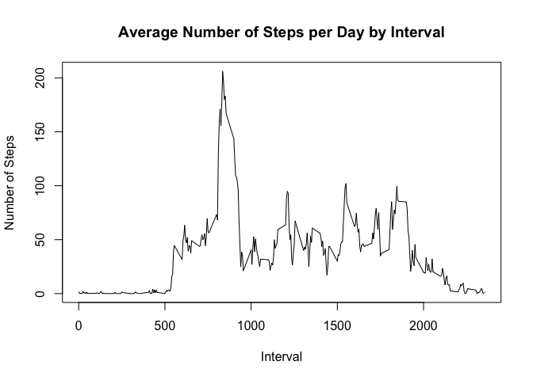
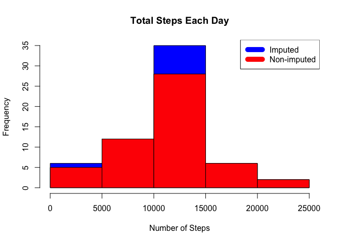
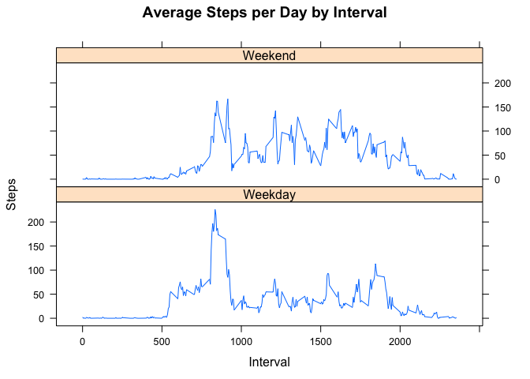

# Reproducible Research: Peer Assessment 1
Sian Lun Lau  
Oct. 2016  

## Loading and preprocessing the data

First, check if the file "activity.zip" exists in the repository. If not, download it. Then unzip and load data into data frame `data`. 

```r
if(!file.exists("activity.zip")) {
        download.file("https://d396qusza40orc.cloudfront.net/repdata%2Fdata%2Factivity.zip","activity.zip")
}
unzip("activity.zip")
data <- read.csv("activity.csv")
```
## What is mean total number of steps taken per day?

Second, add up the steps by day using aggregate. Then, create a histogram.

```r
steps_by_day <- aggregate(steps ~ date, data, sum)
hist(steps_by_day$steps, main = paste("Total Steps Each Day"), col="blue", xlab="Number of Steps")
```

<!-- -->

Next, calculate the mean and median

```r
rmean <- mean(steps_by_day$steps)
rmedian <- median(steps_by_day$steps)
```
The mean steps value is 10766.19, and the median steps value is 10765.

## What is the average daily activity pattern?

Given a interval of 5 minutes, the average number of steps taken shown in a time series plot is as follow:


```r
steps_by_interval <- aggregate(steps ~ interval, data, mean)
plot(steps_by_interval$interval,steps_by_interval$steps, type="l", xlab="Interval", ylab="Number of Steps",main="Average Number of Steps per Day by Interval")
```

<!-- -->


```r
max_interval <- steps_by_interval[which.max(steps_by_interval$steps),1]
```
And the 5-minutes interval that contains the maximum number of steps is 835, calculated using the command above.

## Imputing missing values

In order to calculate the total number of missing values, execute the following commands:


```r
incomplete <- sum(!complete.cases(data))
```

And the total number of missing values is 2304.

A strategy to impute the missing data is to replace the missing values with average for each interval. This is done by the following command:


```r
imputed_data <- transform(data, steps = ifelse(is.na(data$steps), steps_by_interval$steps[match(data$interval, steps_by_interval$interval)], data$steps))
```

For the first day, the NA should be assumed to be zeros. Else, the total steps for day 1 will be way too high and does not seem to fit into the rising trend of the data.


```r
imputed_data[as.character(imputed_data$date) == "2012-10-01", 1] <- 0
```

Recalculating the total steps and create a new histogram that shows the difference between original data and imputed data:


```r
steps_by_day_imputed <- aggregate(steps ~ date, imputed_data, sum)
hist(steps_by_day_imputed$steps, main = paste("Total Steps Each Day"), col="blue", xlab="Number of Steps")

#Create Histogram to show difference. 
hist(steps_by_day$steps, main = paste("Total Steps Each Day"), col="red", xlab="Number of Steps", add=T)
legend("topright", c("Imputed", "Non-imputed"), col=c("blue", "red"), lwd=10)
```

<!-- -->

The new mean and median from the imputed data:


```r
rmean_imputed <- mean(steps_by_day_imputed$steps)
rmedian_imputed <- median(steps_by_day_imputed$steps)
```

and the difference in mean and median, between imputed and non-imputed data:


```r
mean_diff <- rmean_imputed - rmean
median_diff <- rmedian_imputed - rmedian
```

The mean and median for imputed data are 10589.69 and 10766.19 respectively.
The difference between the non-imputed mean and imputed mean is -176.4949.
The difference between the non-imputed median and imputed median is 1.1886792.

The difference between total number of steps for imputed and non-imputed values is calculated as below:


```r
total_diff <- sum(steps_by_day_imputed$steps) - sum(steps_by_day$steps)
```

The imputed values has 75363 more steps than the non-imputed values.


## Are there differences in activity patterns between weekdays and weekends?

The following code will compute the steps by interval and plot a graph to compare the average steps per day  during weekend and weekday.


```r
weekdays <- c("Monday", "Tuesday", "Wednesday", "Thursday", "Friday")
imputed_data$dow = as.factor(ifelse(is.element(weekdays(as.Date(imputed_data$date)),weekdays), "Weekday", "Weekend"))
steps_by_interval_imputed <- aggregate(steps ~ interval + dow, imputed_data, mean)
library(lattice)
xyplot(steps_by_interval_imputed$steps ~ steps_by_interval_imputed$interval|steps_by_interval_imputed$dow, main="Average Steps per Day by Interval",xlab="Interval", ylab="Steps",layout=c(1,2), type="l")
```

<!-- -->

From the plot, there seemed to be more overall activity on weekends. However, there is a higher peak at the earlier interval of the weekday's plot.


